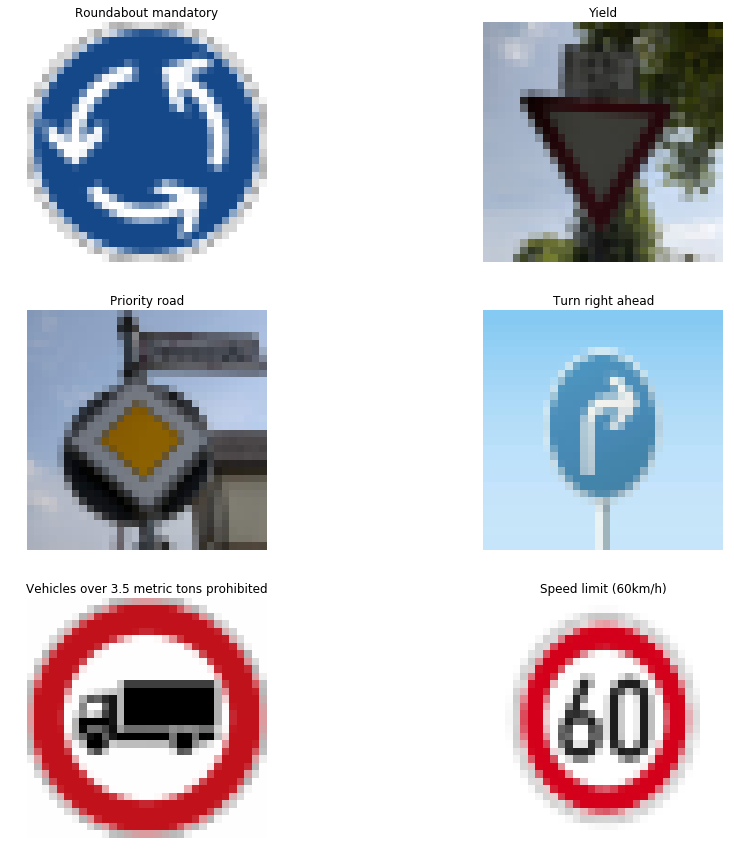

# **Traffic Sign Recognition** 

**Design by Herbert**

---

**Build a Traffic Sign Recognition Project**

***The main work of the project is to train a dataset by CNNS and use it to predict new images*** 

The goals / steps of this project are the following:
* Load the data set (see below for links to the project data set)
* Explore, summarize and visualize the data set
* Design, train and test a model architecture
* Use the model to make predictions on new images
* Analyze the softmax probabilities of the new images
* Summarize the results with a written report

#### 1. Here is my project code.

You're reading it! and here is a link to my [project code](./Traffic_Sign_Classifier.ipynb)

### Data Set Summary & Exploration

#### 1. Read dataset, calculate it, and show it.
Readed `training_file`,`validation_file`,`testing_file`, and `signname`
I used the pandas library to calculate summary statistics of the traffic
signs data set:

* The size of training set is `34799`
* The size of the validation set is `4410`
* The size of test set is `12630`
* The shape of a traffic sign image is `(32,32,3)`
* The number of unique classes/labels in the data set is `43`

#### 2. Include an exploratory visualization of the dataset.

Here is an exploratory visualization of the data set. It is a bar chart showing how the data ...

### Design and Test a Model Architecture

#### 1. Image data normalization

As a first step, I decided to convert the images to grayscale because the colors of the image is useless

Here is an example of a traffic sign image before and after grayscaling by the `normalize()` and grayscale()` function.

As a last step, I did not normalized the image data because when I used (pixel-128/128), I found the accuracy of my CNNS is less than 0.9, however when I canel the formula the accuracy get almost 0.94.

so I did not normalization

I used opencv library RGB2GRAY function to convert the images.

#### 2. LeNet-5 Architecture.

LeNet-5 ArchitectureImplement the LeNet-5 neural network architecture.

This is the only cell you need to edit.

Input The LeNet architecture accepts a 32x32xC image as input, where C is the number of color channels. Since those images are normalized before input, C is 1 in this case.

Architecture Layer 1: Convolutional. The output shape should be 28x28x6.

Activation. Your choice of activation function.

Pooling. The output shape should be 14x14x6.

Layer 2: Convolutional. The output shape should be 10x10x16.

Activation. Your choice of activation function.

Pooling. The output shape should be 5x5x16.

Flatten. Flatten the output shape of the final pooling layer such that it's 1D instead of 3D. The easiest way to do is by using tf.contrib.layers.flatten, which is already imported for you.

dropout function to adjust the result

Layer 3: Fully Connected. This should have 120 outputs.

Activation. Your choice of activation function.

Layer 4: Fully Connected. This should have 84 outputs.

Activation. Your choice of activation function.

Layer 5: Fully Connected (Logits). This should have 43 outputs.

Output Return the result of the 2nd fully connected layer.

My final model consisted of the following layers:

| Layer         		|     Description	        						| 
|:---------------------:|:---------------------------------------------:|
| Input  	       		| 32x32x1 Grayscale image   						| 
| Convolution 3x3     	| 1x1 stride, valid padding, outputs 28x28x6 		|
| RELU					|													|
| Max pooling	 	  	| 2x2 stride,  outputs 14x14x6 						|
| Convolution 3x3	 	| outputs 10x10x16      							|
| Max pooling			| outputs 5x5x16        							|
| Fully connected 		| outputs 120      									|
| Fully Connected		| outputs 84										|
| Fully Connected		| outputs 43										|
 

#### 3. Data Training.

To train the model, I used an Epochs of 60, Batch_size is 512, dropout is 0.5, and learning rate is 0.0006

used functions below:

logits = LeNet(x)

cross_entropy = tf.nn.softmax_cross_entropy_with_logits(labels=one_hot_y, logits=logits)

loss_operation = tf.reduce_mean(cross_entropy)

optimizer = tf.train.AdamOptimizer(learning_rate = rate)

training_operation = optimizer.minimize(loss_operation)

And the training result as follows:

the blue one is validation accuracy

the orange one is training accuracy

#### 4. Describe the approach taken for finding a solution and getting the validation set accuracy to be at least 0.93. Include in the discussion the results on the training, validation and test sets and where in the code these were calculated. Your approach may have been an iterative process, in which case, outline the steps you took to get to the final solution and why you chose those steps. Perhaps your solution involved an already well known implementation or architecture. In this case, discuss why you think the architecture is suitable for the current problem.

My final model results were:
* training set accuracy of `0.998`
* validation set accuracy of `0.956` 
* test set accuracy of `0.942`

The first architecture is LeNet-5. Because it has less parameters and can recognize the images well.

the first problem is the normalization, because after normalization the accuracy has decrease. So I drop the normalization method.

I added dropout after flatten. As it can improve the accuracy.

the Epochs adjust when the it overfitting after 60. So I adjusted it by 60. And the Learning rate  

### Test a Model on New Images

#### 1. Choose five German traffic signs .

Here are five German traffic signs that I found on the web:

The seconde "Yield" image might be difficult to classify because there are some tree behind the sign.

And all images reshape to 32x32 so it may not clearly as the orignal.

#### 2. Discuss the model's predictions on these new traffic signs and compare the results to predicting on the test set.

Here are the results of the prediction:

The model was able to correctly guess 5 of the 6 traffic signs, which gives an accuracy of 83.33%. This compares favorably to the accuracy on the test set of six new image

#### 3. Describe how certain the model is when predicting on each of the five new images by looking at the softmax probabilities for each prediction. Provide the top 5 softmax probabilities for each image along with the sign type of each probability. (OPTIONAL: as described in the "Stand Out Suggestions" part of the rubric, visualizations can also be provided such as bar charts)

The code for making predictions on my final model is here:

with tf.Session() as sess:
    saver.restore(sess, tf.train.latest_checkpoint('.'))
    predicted_logits = sess.run(logits, feed_dict={x: X_image,keep_prob:1.0})
    top = sess.run(tf.nn.top_k(tf.nn.softmax(predicted_logits),k=5))
    ind=np.arange(0,5,1) 
    
    for i in range(len(new_images)):
        plt.imshow(new_images[i])
        plt.show()
        plt.barh(ind,top.values[i])
        plt.yticks(ind,signname.iloc[top.indices[i]]['SignName'])
        plt.grid(axis='x')
   

        plt.show()
		
and the result as follows:

### (Optional) Visualizing the Neural Network (See Step 4 of the Ipython notebook for more details)
#### 1. Discuss the visual output of your trained network's feature maps. What characteristics did the neural network use to make classifications?

the out put as follows:

### Discussion point:

#### Deeper Networks: there could be an improvement in performance using
* Deeper network such as VGG16 ( paper link)
* Using ensembling technique such as inception module : paper link

